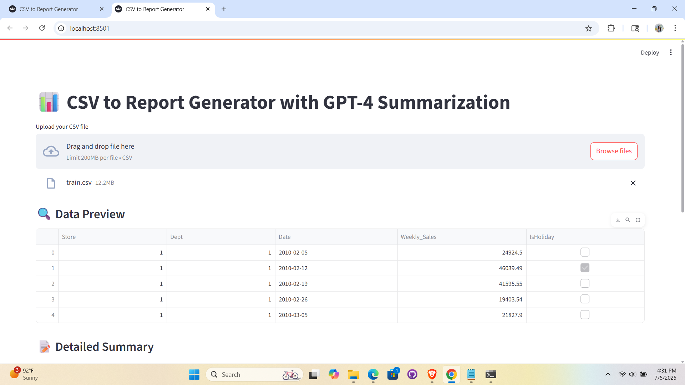
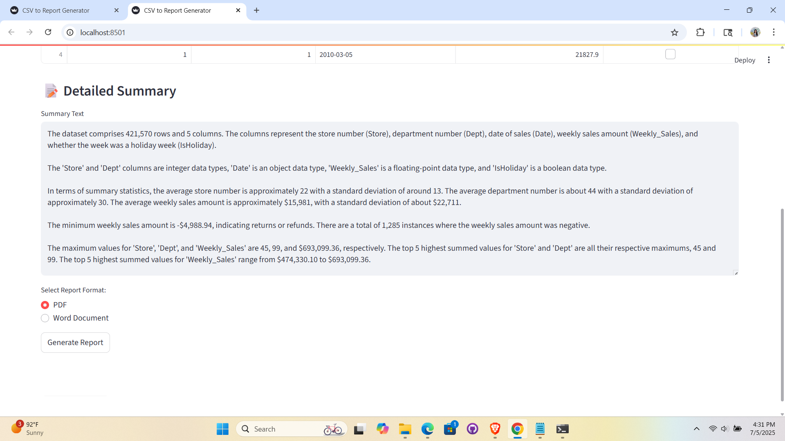
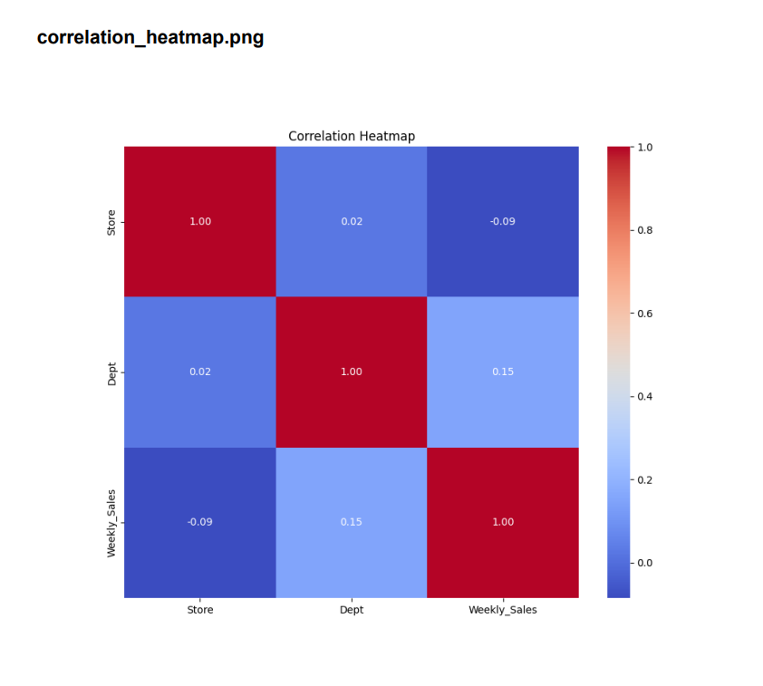
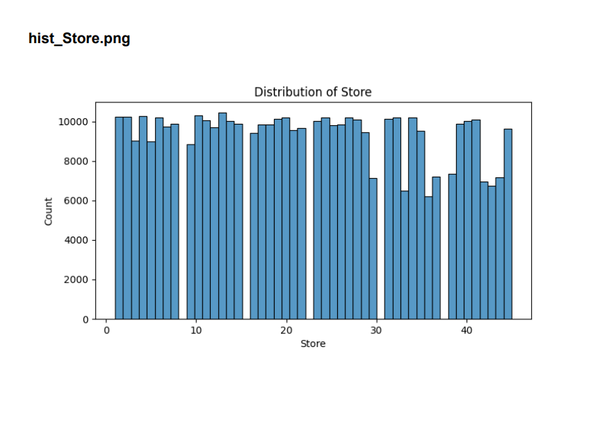
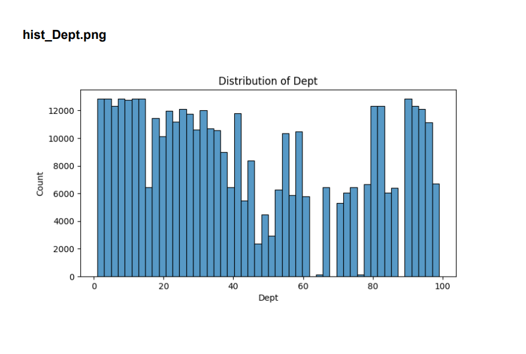

# Automated Data Insights with LLMs

This project is an **end-to-end data analysis and reporting tool** that:
- Analyzes your CSV datasets
- Generates descriptive plots
- Summarizes the dataset using **OpenAI Large Language Models (LLMs)**
- Creates downloadable PDF and Word reports
- Provides an interactive **Streamlit UI**

---


## Project Workflow

Below is a high-level workflow diagram of how the project operates:

```
CSV File  
     |  
     v  
[Streamlit UI]  
     |  
     v  
[Data Validation & Cleaning]  
     |  
     v  
[Plot Generation (Seaborn/Matplotlib)]  
     |  
     v  
[Summary Creation (OpenAI LLM)]  
     |  
     v  
[PDF Report + Word Export]
```

---

## Features

- Automatic dataset profiling  
- Intelligent summarization using OpenAI models  
- Clean, informative visualizations  
- Option to export reports in PDF or Word format  
- Streamlit-based user interface

---

## User Interface

**Upload CSV and Generate Report**



**Generated Summary and Download Options**



**EDA Plots Example**





---

## Step-by-Step Setup Instructions

Follow these steps carefully to set up and run the project on your machine:

---

### 1) Clone the Repository

```bash
git clone https://github.com/yourusername/automated-data-insights-llms.git
cd automated-data-insights-llms
```

---

### 2) Create and Activate a Python Virtual Environment

**Windows:**
```bash
python -m venv venv
venv\Scripts\activate
```

**macOS/Linux:**
```bash
python3 -m venv venv
source venv/bin/activate
```

---

### 3) Install Project Dependencies

```bash
pip install -r requirements.txt
```

**OR install manually:**

```bash
pip install streamlit pandas matplotlib seaborn fpdf openai python-docx
```

---

### 4) Create an OpenAI Account and API Key

1. Go to [https://platform.openai.com/](https://platform.openai.com/)
2. Log in or create an account
3. In your dashboard, click **API Keys**
4. Click **+ Create new secret key**
5. Copy the key and keep it secure

---

### 5) Configure the API Key in `app.py`

In `app.py`, locate this code:

```python
client = OpenAI(api_key="sk-...")
```

Replace `"sk-..."` with your actual OpenAI API key:

```python
client = OpenAI(api_key="sk-YourSecretKeyHere")
```

---

### 6) Using the OpenAI Model for Summarization

By default, this project uses `gpt-4`.  
To use `gpt-3.5-turbo` instead, change the model parameter:

```python
response = client.chat.completions.create(
    model="gpt-3.5-turbo",  # or "gpt-4"
    messages=[
        {"role": "system", "content": "You are a data analysis expert. Summarize this dataset in a clear and insightful way."},
        {"role": "user", "content": text}
    ]
)
```

---

### 7) Important Notes Before Running the App

- Keep your sample CSV file size below 200 MB  
- Use a well-structured CSV for best results (e.g., numeric + categorical columns)  
- After activating your virtual environment, be sure to navigate to the folder containing **app.py** in your terminal or command prompt before running any commands 
- When you run `streamlit run app.py`, it will prompt you to log in with your email (or create an account)  
- Once you click **Generate Report**, wait for 1–2 minutes for processing, especially for larger datasets

---

### 8) Running the Streamlit App Locally

Navigate to the folder containing `app.py` and run:

```bash
streamlit run app.py
```

This will launch the app in your browser (`http://localhost:8501`), where you can:
- Upload a CSV file
- View data preview
- Generate visualizations
- Summarize your data
- Export reports in PDF and Word formats

---

## Sample CSV

You can use any CSV you like. Here's a recommended test file:
- [`sample_superstore.csv`](https://www.kaggle.com/datasets/vivek468/superstore-dataset-final)

---

## Example Use Cases

- Exploratory data analysis for analysts  
- Quick profiling for business teams  
- Summarizing data for stakeholders without writing code  

---

## Author

**Isha Narkhede**  
[LinkedIn](https://www.linkedin.com/in/isha-narkhede/) • [GitHub](https://github.com/Isha2605)

